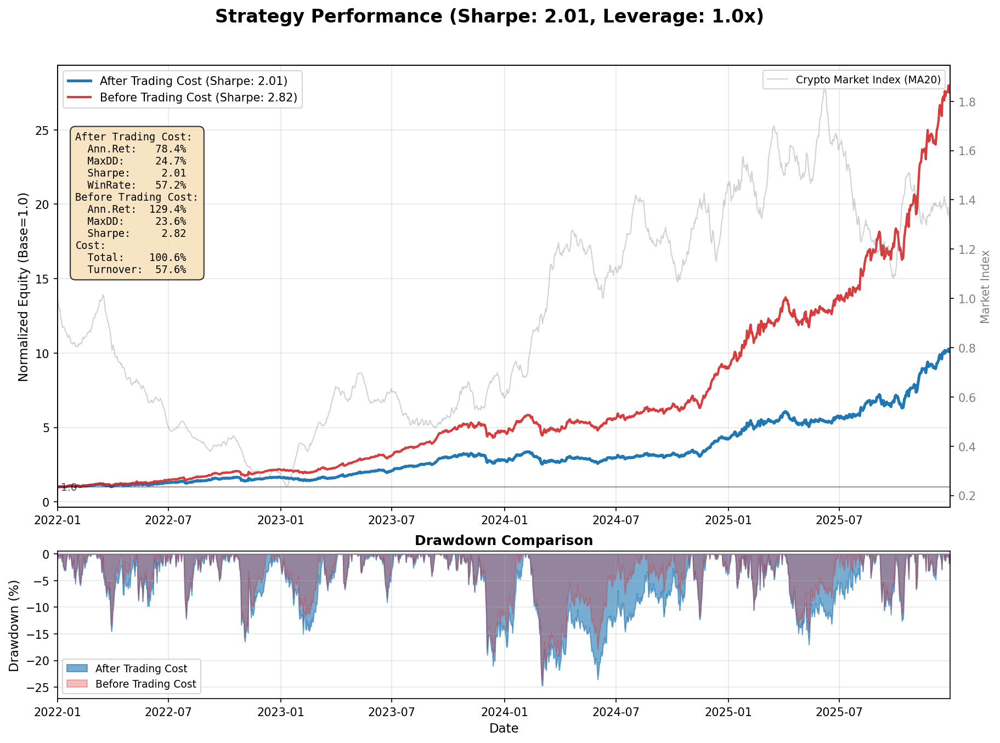
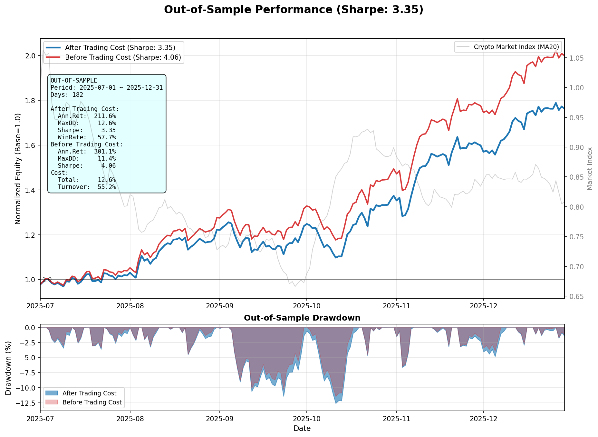
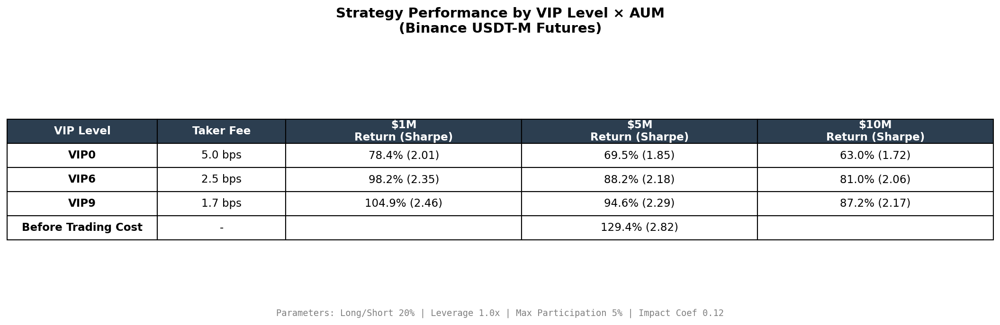
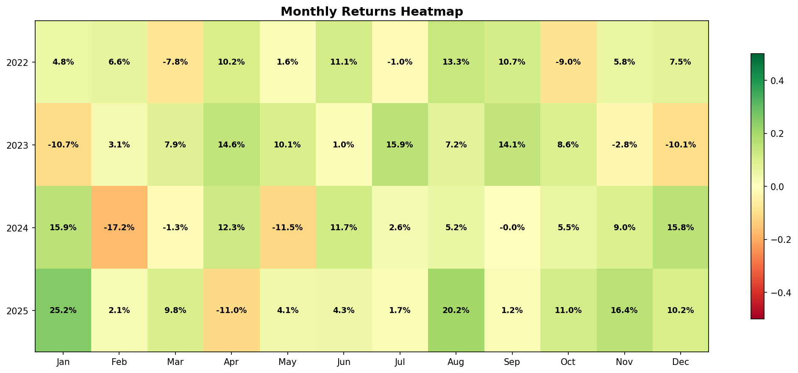

# 加密货币多因子截面策略

## 策略概述

基于多因子截面分析的加密货币量化策略。每日在流动性前40%的标的中，根据因子信号做多Top 20%、做空Bottom 20%，等权因子组合，sqrt(quote_volume)加权标的，日频调仓。

**核心特点：**
- 因子挖掘池：459个币种（Binance U本位永续合约，日均成交额前90%）
- 实际交易池：459池中流动性前40%（Q1+Q2档位，约39~183个）
- 8个低相关因子等权组合（基于Sharpe优化筛选）
- 交易价值按sqrt(quote_volume)加权，避免低流动性币过度暴露
- 基于订单簿实测的真实交易成本模型
- 样本内/样本外分离验证，防止过拟合

---

### 实际交易标的数


459池中的币种逐年上线，策略只在当日已上线币种中流动性前40%的标的上建仓（Q1+Q2档位）。2022年初约39个，2025年底约183个。

---

## 策略表现
### 全样本表现



### 样本外表现



**样本划分：**
- **样本内 (In-Sample)**：2022-01-01 ~ 2025-06-30（用于因子筛选优化）
- **样本外 (Out-of-Sample)**：2025-07-01 ~ 2025-12-31（用于验证）

---

## 交易成本模型

### 成本构成

```
单笔交易成本 = Taker手续费 + 市场冲击(滑点)

其中：
- Taker手续费 = 0.05% (Binance Futures VIP0费率，VIP6费率为0.025%，VIP9费率为0.017%)
- 市场冲击 = c × σ × √(participation_rate)
```

### 市场冲击模型

采用 **Square Root Law**：

```python
impact = impact_coef × daily_volatility × sqrt(participation_rate)

其中：
- impact_coef = 0.12 (基于订单簿实测校准，+20%安全边际)
- daily_volatility = 20日滚动波动率
- participation_rate = 交易金额 / 该标的日成交额
```

### 订单簿实测验证

为验证市场冲击模型参数的合理性，我们在2025年12月对11个代表性标的进行了实时订单簿测试。

#### 测试方法

1. **标的选择**：从459个币池的Top 40%流动性筛选后，按quote_volume分位数选取11个代表性标的
2. **交易金额**：基于$5M AUM和sqrt(quote_volume)加权计算各标的的实际交易金额
3. **滑点计算**：根据实时订单簿深度，计算买入/卖出指定金额的加权平均成交价与中间价的偏离

#### 测试结果

| 标的 | 层级 | 日均成交额 | 权重 | 实际滑点 | 状态 |
|------|------|-----------|------|---------|------|
| BTCUSDT | Top 1 | $12,386M | 7.18% | 0.01 bp | ✓ 极好 |
| SOLUSDT | Top 3 | $2,792M | 3.41% | 0.43 bp | ✓ 极好 |
| SUIUSDT | Top 5% | $351M | 1.21% | 2.21 bp | ✓ 良好 |
| AVAXUSDT | Top 10% | $203M | 0.92% | 1.14 bp | ✓ 极好 |
| TRXUSDT | Top 30% | $57M | 0.49% | 0.36 bp | ✓ 极好 |
| LDOUSDT | Median 50% | $29M | 0.35% | 3.56 bp | ✓ 良好 |
| METUSDT | Top 70% | $18M | 0.27% | 7.76 bp | ○ 一般 |
| SNXUSDT | Bottom 10% | $12M | 0.22% | 13.21 bp | ○ 一般 |
| AIXBTUSDT | Bottom 1 | $11M | 0.21% | 12.10 bp | ○ 一般 |
| LYNUSDT | Median | $30M | 0.35% | 29.40 bp | ⚠️ 异常 |
| POLYXUSDT | Bottom 25% | $16M | 0.26% | 24.60 bp | ⚠️ 异常 |

#### 关键发现

1. **高流动性币深度极好**：BTC、SOL、AVAX、TRX等主流币滑点均 < 2 bp
2. **异常个例存在**：LYNUSDT和POLYXUSDT虽然日均成交额不低（$16-30M），但订单簿深度异常薄
3. **同层级对比验证**：LDOUSDT与LYNUSDT日均成交额相近（~$30M），但滑点差异巨大（3.6 bp vs 29.4 bp），说明异常是做市商活跃度问题，非普遍现象

**最终决策：`impact_coef = 0.12`（+20%安全边际）**

理由：
- 高权重币实际滑点接近理论值，模型基本准确
- 部分中低流动性币滑点高于预期，增加20%安全边际更稳健
- 异常币（LYN+POLYX）权重仅 **0.6%**，影响有限但仍需谨慎
- sqrt(volume)加权机制本身抑制了低流动性币的影响
- 保守估计对实盘更安全，避免低估交易成本

---

### 交易成本敏感性分析

不同VIP等级和AUM规模对策略表现的影响：



| VIP等级 | Taker费率 | 说明 |
|---------|----------|------|
| VIP0 | 5.0 bps | Binance基础费率 |
| VIP6 | 2.5 bps | 30日交易量≥4亿USDT |
| VIP9 | 1.7 bps | 30日交易量≥40亿USDT |

---

## 因子研究流程

### 1. 因子挖掘

#### 数据来源
- **分钟级数据**：Binance U本位永续合约历史K线（OHLCV + taker_buy_volume + trades）
- **时间格式**：UTC时间，覆盖459个流动性合格标的(全市场基于quote_volume的90%截尾)

#### 加密市场适配
- **24/7市场**：重新定义时段划分，分析亚欧美不同时段的价格行为差异
- **高波动特性**：调整波动率计算窗口和极值处理方式
- **高换手率**：加密市场日换手率远高于传统市场，因子衰减更快，需要更高频的调仓
- **流动性分层明显**：头部币种（BTC/ETH）与长尾山寨币流动性差异巨大，需按成交额加权避免小币过度暴露

#### 因子库规模
- **日频技术因子**：52个（动量、波动率、趋势、量价、形态、相关性、风险7大类）
- **日内因子**：85个（从分钟数据聚合）
- **合计**：137个候选因子

---

### 2. 单因子审查

#### 筛选标准
```
合格因子 = |IC| >= 0.02 AND Sharpe >= 0.5
```

| 指标 | 阈值 | 说明 |
|-----|------|------|
| IC（信息系数）| ≥ 0.02 | 因子值与下期收益的Spearman相关性 |
| Sharpe（多空策略）| ≥ 0.5 | 做多Top 20%，做空Bottom 20%的夏普比率 |

#### 回测方法
- **等权分层**：按因子值分5组（Q1-Q5），每组内等权
- **测试期**：2022-01-01起（样本内）

> ⚠️ **关键处理：动态Winsorize**
> 
> **每日横截面收益按1%-99%分位数截断**（防止极端值影响单层回测表现）
> 
> 这一步至关重要：加密市场存在大量极端收益（山寨币单日能达到±100%），若不做截断处理，少数极端样本会严重扭曲因子评估结果，导致因子看起来有效但实际不可交易。

#### 筛选结果
- 137个候选因子 → **22个合格因子**（4个日频 + 18个日内）
- 合格率：16%

---

### 3. 因子筛选优化

从22个合格因子中，通过组合优化选取最终8个：

#### 优化约束
- 因子间IC相关性 ≤ 0.7（避免高度相关因子重复暴露）
- 最少8个因子（保证分散化）
- 单因子Sharpe ≥ 1.0（更严格的质量门槛）

#### 优化目标
**最大化扣费后组合Sharpe**（而非扣费前），仅使用样本内数据

#### 优化算法
贪心算法 + 模拟退火：
1. 按单因子Sharpe降序，贪心选取满足相关性约束的因子
2. 随机扰动（添加/删除/替换因子），接受更优解
3. 模拟退火允许一定概率接受较差解，跳出局部最优
4. 迭代500次

#### 样本外验证
选定因子后，在样本外期间（2025-07-01 ~ 2025-12-31）独立回测，评估策略稳定性。

---

## 因子体系

### 因子筛选标准

详见上文"因子研究流程"章节。最终从137个候选因子中筛选出8个：

### 8个选定因子

| 因子 | 类别 | 频率 | 说明 |
|------|------|------|------|
| pv_divergence | 量价关系 | 日频 | 量价背离 |
| max_buy_pressure_1h | 微观结构 | 日内 | 1小时最大买压 |
| vol_cv | 波动率 | 日内 | 成交量变异系数 |
| trade_size_skew | 微观结构 | 日内 | 单笔成交量偏度 |
| early_main_diff | 时段效应 | 日内 | 早盘vs后续收益差 |
| info_entropy | 信息分布 | 日内 | 信息分布熵 |
| amihud_illiq_log | 流动性 | 日内 | Amihud非流动性(log) |
| max_drawdown_intra | 风险 | 日内 | 日内最大回撤 |

### 因子详解

#### 1. pv_divergence（量价背离）

**逻辑：** 价格变化与成交量变化的差异。

```python
price_change = close.pct_change(20)
volume_change = volume.pct_change(20)
factor = price_change - volume_change
```

**经济含义：** 经典技术分析指标。价涨量缩（正背离）预示上涨乏力，价跌量缩（负背离）预示下跌动能衰竭。

---

#### 2. max_buy_pressure_1h（1小时最大买压）

**逻辑：** 基于分钟级数据，计算日内滚动1小时窗口的买压（taker_buy_volume / volume）最大值。

```python
# 每分钟的买压
buy_pressure = taker_buy_volume / volume
# 滚动60分钟窗口均值
rolling_buy_pressure = rolling_mean(buy_pressure, window=60)
factor = max(rolling_buy_pressure)
```

**经济含义：** 捕捉日内集中买入行为。当某个小时内主动买入占比极高时，说明存在强烈的买入意愿，可能预示后续价格上涨。

---

#### 3. vol_cv（成交量变异系数）

**逻辑：** 基于分钟级数据，计算日内每分钟成交量的变异系数。

```python
# 每分钟成交量序列
minute_volume = [volume_t for t in day]
# 变异系数
factor = std(minute_volume) / mean(minute_volume)
```

**经济含义：** 成交量分布的不均匀程度。高CV说明存在成交量突增时段，往往对应重要信息发布或大户交易。

---

#### 4. trade_size_skew（平均单笔成交规模偏度）

**逻辑：** 基于分钟级数据，计算每分钟的平均单笔成交规模（volume / trades），然后计算日内该序列的偏度。

```python
# 每分钟的平均单笔成交规模
avg_trade_size = minute_volume / minute_trades
factor = skewness(avg_trade_size)
```

**经济含义：** 正偏度表示日内存在少数分钟出现异常大单，可能是机构集中建仓的信号。大单通常代表知情交易者，其方向具有预测性。

---

#### 5. early_main_diff（早盘vs后续收益差）

**逻辑：** 基于分钟级数据，比较一天中前30分钟与后续时段的累计收益差异。

```python
# 分钟级收益
minute_returns = price.pct_change()
early_return = sum(minute_returns[0:30])
main_return = sum(minute_returns[30:])
factor = early_return - main_return
```

**经济含义：** 早盘反映亚洲时段交易者的情绪，若早盘涨但后续跌，说明早盘可能是虚假突破。该因子捕捉时段间的反转效应。

---

#### 6. info_entropy（信息分布熵）

**逻辑：** 基于分钟级数据，将一天分为12个时段（每段约2小时），计算各时段收益绝对值之和的分布熵。

```python
# 分钟级收益
minute_returns = price.pct_change()
# 每个时段的绝对收益之和
period_abs_return = [sum(|minute_returns|) for each 2-hour period]
# 归一化为概率
prob = period_abs_return / sum(period_abs_return)
factor = -sum(prob * log(prob))
```

**经济含义：** 熵高说明信息均匀分布在全天，熵低说明信息集中在某些时段。信息集中往往意味着存在知情交易，具有方向预测性。

---

#### 7. amihud_illiq_log（Amihud非流动性对数）

**逻辑：** 基于分钟级数据，计算日内平均Amihud非流动性的对数。

```python
# 每分钟的非流动性
illiq_per_minute = |minute_return| / minute_volume
# 日内均值的对数
factor = log(mean(illiq_per_minute) + 1e-10)
```

**经济含义：** 对数变换后信号更稳定，减少极端值影响。非流动性高的资产风险溢价高，具有收益预测性。

---

#### 8. max_drawdown_intra（日内最大回撤）

**逻辑：** 基于分钟级数据，计算日内价格从高点到低点的最大回撤。

```python
# 分钟级价格
minute_close = [close_t for t in day]
# 滚动最高点
rolling_max = maximum.accumulate(minute_close)
# 回撤
drawdown = (minute_close - rolling_max) / rolling_max
factor = min(drawdown)  # 最大回撤（负值）
```

**经济含义：** 捕捉日内极端下跌后的反弹效应。经历大幅回撤的标的往往在次日有均值回归，因为恐慌性抛售往往过度。

---

### 因子相关性


8个因子的最大IC相关性为0.52，保证了组合的分散化效果。

---

## 加密市场指数

为了评估策略相对于市场的表现，我们构建了一个流动性加权的加密市场指数作为基准。

### 计算逻辑

```python
# 每日计算成交额加权平均价格
weighted_price = sum(close × quote_volume) / sum(quote_volume)

# 归一化到起点为1
market_index = weighted_price / weighted_price[0]

# 可视化时使用20日移动平均平滑
market_index_smooth = market_index.rolling(window=20).mean()
```

### 设计原理

1. **成交额加权**：类似于传统金融中的市值加权指数（如S&P 500），但加密市场用成交额替代市值，更能反映实际流动性分布

2. **平滑处理**：原始指数波动剧烈（加密市场特性），使用20日移动平均使趋势更清晰

### 指数特点

- 覆盖459个Binance U本位永续合约标的
- BTC、ETH等大市值币种权重较高，反映市场主流走势
- 可用于评估策略的市场中性程度

---

## 月度收益分布



---

## 因子分析


---

## 回测配置

```python
# 策略参数
LONG_PCT = 0.20          # 做多比例 (Top 20%)
SHORT_PCT = 0.20         # 做空比例 (Bottom 20%)
LEVERAGE = 1.0           # 杠杆倍数 (1x = 多空各50%)

# 成本参数
TAKER_FEE = 0.0005       # Taker手续费 0.05%
IMPACT_COEF = 0.12       # 市场冲击系数（订单簿实测校准，+20%安全边际）
AUM = 5_000_000          # 策略规模 $5M
MAX_PARTICIPATION = 0.05 # 最大参与率限制 5%

# 样本划分
IN_SAMPLE_END = "2025-06-30"     # 样本内结束
OUT_SAMPLE_START = "2025-07-01"  # 样本外开始
```

### 回测时序逻辑

为避免数据泄露（Look-ahead Bias），回测严格遵循以下时序：

```
T日 24:00    → 计算T日因子（使用T日全天数据）
T+1日 00:00  → 根据T日因子排名，以 open[T+1] 开仓
T+2日 00:00  → 根据T+1日因子调仓，以 open[T+2] 平仓

因此：fwd_ret[T] = open[T+2] / open[T+1] - 1
```

**关键点：**
- 使用 **open-to-open** 收益率
- T日因子对应的持仓收益是 T+1 至 T+2 日的open价格变动

---

## 文件结构

```
├── crypto_strategy.py       # 核心策略模块
│   ├── FACTOR_CONFIG        # 因子配置（其他脚本自动读取）
│   ├── 因子加载器
│   ├── 因子分析器
│   ├── 回测引擎（带交易成本）
│   └── 数据加载函数
│
├── crypto_visualization.py  # 可视化与执行脚本
│   ├── 图表生成函数
│   ├── 市场指数计算
│   ├── 样本外回测
│   └── 主执行逻辑
│
├── factor_selection.py      # 因子筛选优化脚本
│   ├── 样本内/样本外数据划分
│   ├── 带交易成本的回测
│   ├── 贪心+启发式搜索
│   ├── 模拟退火优化
│   └── 样本外验证
│
├── volume_analysis.py       # 流动性分层归因分析
│   ├── 自动读取FACTOR_CONFIG
│   ├── 按quote_volume分5档
│   └── 各档位独立策略回测
│
├── factors/                 # 预计算因子值文件
│   ├── daily_factors.csv
│   └── intraday_factors.csv
│
├── futures_data/            # 日频价格数据
│   └── *.csv
│
├── futures_data_1m/         # 分钟频价格数据
│   └── *.parquet
│
└── output/                  # 输出图表
    ├── strategy_performance.png
    ├── out_of_sample_performance.png  # 样本外净值曲线
    ├── tradeable_universe_heatmap.png # 实际交易标的热力图
    ├── factor_correlation.png
    ├── monthly_returns.png
    ├── factor_analysis.png
    └── vip_aum_comparison.png
```